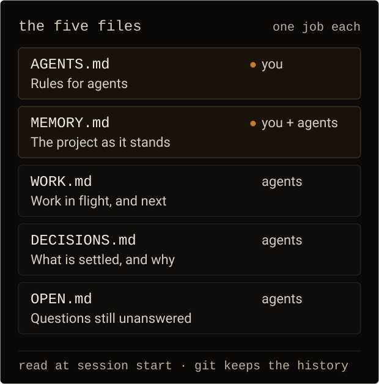
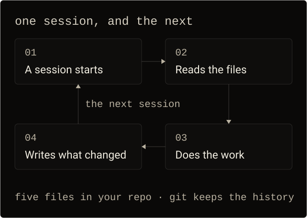

<p align="center">
  
</p>

<h1 align="center">Prefrontal Context</h1>

<p align="center"><strong>Project context that stays with the repository.</strong></p>

<p align="center">
  <code>v0.4.0</code>&nbsp; <code>106 lines</code>&nbsp; <code>5 files</code>&nbsp; <code>no install</code>&nbsp; <code>no account</code>&nbsp; <code>no AI provider</code>&nbsp; <code>MIT</code>
</p>

<p align="center">
  <a href="https://prefrontal.dev">prefrontal.dev</a> &nbsp;·&nbsp;
  <a href="PROMPT.md">setup prompt</a> &nbsp;·&nbsp;
  <a href="#the-five-files">the five files</a> &nbsp;·&nbsp;
  <a href="#install-by-hand">install by hand</a>
</p>

---

Five markdown files in your repository carry the rules an agent has to follow, what the project is, what is in flight, what is settled, and what nobody has answered yet. Every session starts from the same record instead of from a chat that has scrolled away.

## The five files



| File | Owns | Maintained by |
| --- | --- | --- |
| `AGENTS.md` | Rules for agents, including the memory rules | Owner (agents propose, never materially edit) |
| `MEMORY.md` | Current project context | Agents (Direction section records the owner's words) |
| `WORK.md` | Execution context: active and planned work | Agents |
| `DECISIONS.md` | Decisions that currently stand | Agents |
| `OPEN.md` | Unresolved questions | Agents |

Git-managed files hold canonical project knowledge. A developer can switch coding agents without moving project truth into a proprietary memory service. Different agents may behave differently — this does not promise identical execution or automatic compliance.

## One session, and the next



Read at the start, written back as the work happens. The next agent does not ask you what the project is; it reads what the last one recorded.

## Set it up with your agent

Paste this into your agent, in the repository you want it set up in. It creates the five files, fills them from what it can verify, asks you only for what is yours to decide, and merges instead of overwriting an existing `AGENTS.md`.

```text
Set up Prefrontal Context in this repository: five markdown files that keep project
memory between agent sessions. Work only in this repository.

The files and what each owns:
  AGENTS.md    - rules an agent must follow here, including how to maintain the
                 other four files. Owner-governed.
  MEMORY.md    - the project as it stands: direction (owner-governed), state,
                 architecture, conventions and quirks, how to verify.
  WORK.md      - what is being worked on now and what comes next.
  DECISIONS.md - decisions that currently stand, and why.
  OPEN.md      - questions nobody has settled yet.

Templates: https://github.com/itsabk/prefrontal-context (or the copies already in
this repository, if they are there). Keep their rules; do not invent replacements.

1. Create the five files at the repository root. If AGENTS.md already exists, merge
   these rules into it and keep every rule that is already there. If CLAUDE.md
   exists, append the line `@AGENTS.md`; if the platform you run on reads a
   different instruction file, add the equivalent one-line loader pointing at
   AGENTS.md.

2. MEMORY.md's Direction section and AGENTS.md's Project rules are mine to write,
   not yours. Ask me for my words before you fill them: at most three questions,
   in one message, then wait for my answer. Record what I say in my words.

3. Fill every other section from what you actually verify in this repository, and
   say how you know - the command, the test, or the file you read. Replace each
   italic placeholder prompt with real content. Rename, merge or drop sections that
   do not fit this project, but leave no section holding only its own prompt.

4. If this repository already has notes, roadmaps, progress logs or handoff files,
   fold what is still current into the five files and list the rest for me to
   delete or archive. Keep real project documents - specs, plans, design docs,
   contracts - as documents, and reference them from MEMORY.md instead of copying
   them in. Leave one home per fact.

5. Never invent a fact. Anything you cannot verify goes in OPEN.md as a question.
   If something you find contradicts a recorded decision, tell me rather than
   editing the decision yourself.

6. From now on, read these files before non-trivial work and keep them current in
   the same piece of work: record what changed, prune what is stale or false, and
   use git for history instead of keeping old text in the files.

7. When the setup is done, report: the files you wrote, the facts you verified with
   the commands you ran, what you need from me, and anything you deliberately left
   out.

Do not add indexes, sync scripts, hooks or other machinery for these files unless I
ask for it.
```

The same prompt is served at [prefrontal.dev/setup.txt](https://prefrontal.dev/setup.txt) and kept in [`PROMPT.md`](PROMPT.md), for agents that can fetch a URL. If the three ever disagree, `PROMPT.md` is the one that counts.

---

## Install by hand

1. Copy `AGENTS.md`, `MEMORY.md`, `DECISIONS.md`, `WORK.md`, and `OPEN.md` into the repository root. If the repo already has an `AGENTS.md`, merge this template's harness sections into it instead of overwriting — keep your existing rules.
2. `CLAUDE.md` is a one-line loader (`@AGENTS.md`) for platforms that don't read `AGENTS.md` natively. Keep it only if you need it; if a `CLAUDE.md` already exists, append the `@AGENTS.md` line rather than replacing the file. For any platform whose agent-instruction surface differs, create its equivalent one-line loader pointing at `AGENTS.md`.
3. Fill `MEMORY.md`'s Direction section with what you actually want, in your own words. Then ask an agent to inspect the repository and fill State, Architecture, Conventions, and How-to-verify from verified facts only. The italic prompts inside the template files are placeholders — replace them with real content. Plain-prose notes (like the Agent line in `AGENTS.md`) are standing rules — keep them.
4. If the repo already has memory-like files (notes, roadmaps, progress logs), fold anything still current into the five files and delete or archive the rest. Keep genuinely useful project documents — specs, plans, design docs, contracts — as project documents, and reference them from the memory files. Don't leave parallel sources of truth.

Only the five files are copied into your project; this README and `PROMPT.md` stay here, and agents never read them.

## Operating

- Agents read `AGENTS.md`, `MEMORY.md`, `DECISIONS.md`, and `OPEN.md` at session start (plus `WORK.md` when continuing or planning work), then maintain the files as they work; the rules in `AGENTS.md` govern exactly how.
- Your surface is `MEMORY.md`'s Direction section, any conventions you state there, and `AGENTS.md`'s Project rules section — review those occasionally. Let agents maintain everything else.
- To change direction or rules, say so in conversation; agents record it. They won't edit owner-governed material unilaterally.
- History is git. Nothing needs running; nothing regenerates; there is nothing to operate.

## Remove

Delete the five files (and `CLAUDE.md` if it only points at `AGENTS.md`). Nothing was installed elsewhere.

## License

MIT. See `LICENSE`.

---

<p align="center"><sub>Prefrontal Context · <a href="LICENSE">MIT</a> · <a href="https://prefrontal.dev">prefrontal.dev</a> · <a href="https://prefrontal.dev/setup.txt">setup.txt</a></sub></p>
